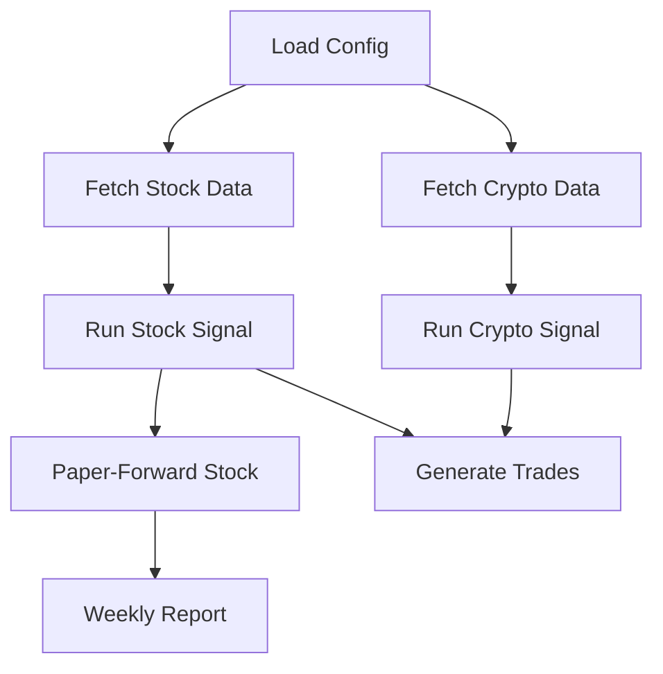
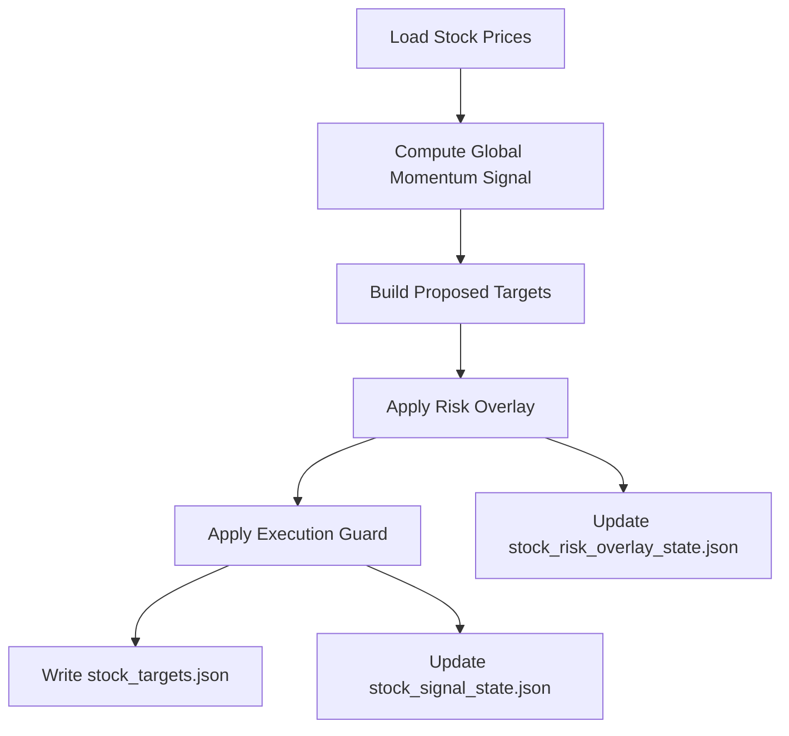
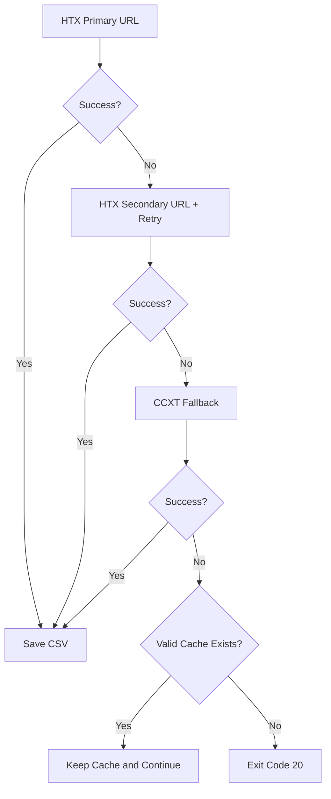
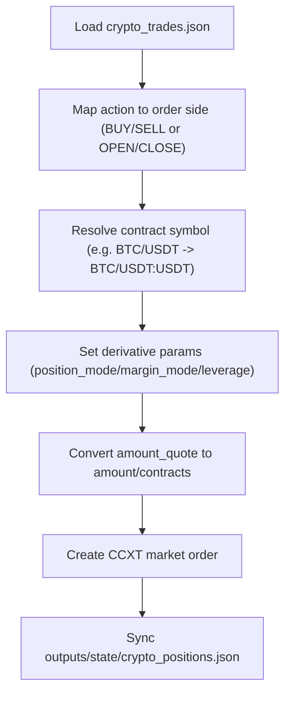

# 量化交易系统 软件需求（生产版）

## 1. 文档目的
本文档定义 `quant-system` 的当前生产候选能力、接口协议、错误码、流程与验收标准。  
文档基于 2026-02-19 最新代码与回测/仿真结果整理。

## 2. 系统范围与目标
### 2.1 范围
- 市场：A 股 ETF（股票子系统）+ 加密货币现货/合约（币圈子系统）。
- 运行模式：默认 `paper`（输出目标仓位与拟交易指令，不直接下单）。
- 能力：拉取数据、计算信号、执行门控、风控覆盖、回测、paper-forward 监控、周报输出。

### 2.2 目标
- 提供可重复运行的自动化策略流水线。
- 信号与输出具备可追踪状态（state + report）。
- 核心脚本在失败时返回标准化退出码，便于调度系统识别。

## 3. 总体架构
### 3.1 模块
- `scripts/stock_etf/fetch_stock_etf_data.py`：拉取/更新 A 股 ETF 数据（含缓存降级）。
- `scripts/crypto/fetch_crypto_data.py`：拉取/更新加密数据（HTX 直连 + 多域名重试 + CCXT 兜底 + 缓存降级）。
- `scripts/stock_etf/run_stock_etf.py`：股票信号引擎（`global_momentum` 主模型 + 执行门控 + 风控覆盖）。
- `scripts/crypto/run_crypto.py`：币圈信号引擎（多因子 + risk-off + 合约模式防守/可选做空）。
- `scripts/stock_etf/generate_trades_stock_etf.py`：ETF 目标仓位与当前持仓差分，输出股票交易指令。
- `scripts/stock_etf/execute_trades_stock_etf.py`：执行 ETF 股票交易指令。
- `scripts/crypto/generate_trades_crypto.py`：crypto 目标仓位与当前持仓差分，输出币圈交易指令。
- `scripts/crypto/execute_trades_crypto.py`：执行币圈交易指令（现货/合约）。
- `scripts/stock_etf/backtest_stock_global_model.py`：股票主模型基线回测。
- `scripts/stock_etf/backtest_stock_model_lab.py`：模型对比、参数扰动、walk-forward。
- `scripts/stock_etf/backtest_stock_production_search.py`：生产口径参数搜索（paper-forward 引擎 + 稳定性门控）。
- `scripts/stock_etf/backtest_stock_etf.py`：股票（ETF）轻量回测（支持 `production|research|both`），并固化 `stock_backtest_snapshot.csv` 与指纹元数据。
- `scripts/stock_etf/backtest_stock_etf_cpcv.py`：CPCV 稳健性验证（分组组合切片 + 门槛判定 + N/k/embargo 网格搜索），默认复用 `stock_backtest_snapshot.csv`，可 `--force-refresh-snapshot` 强制重建。
- `scripts/stock_etf/snapshot_utils.py`：回测快照读写与数据指纹工具（SHA256、行数、起止日期）。
- `scripts/crypto/backtest_crypto.py`：币圈轻量回测。
- `scripts/crypto/validate_crypto_contract.py`：币圈合约模型稳健性验证（全样本/OOS/成本压力）。
- `scripts/crypto/optimize_crypto_contract.py`：币圈合约参数随机搜索（兼顾 full/OOS/stress 目标）。
- `scripts/stock_etf/paper_forward_stock.py`：股票逐日 paper-forward 监控。
- `scripts/stock_etf/report_stock_weekly.py`：周度聚合报告。
- `scripts/run_quant.py`：全流程编排（支持跳过拉取与跳过报告）。
- `scripts/notify_healthcheck_wecom.py`：健康检查异常告警推送企业微信。
- `scripts/reset_wecom_dedup.py`：重置企业微信告警去重状态。
- `core/exposure_gate.py`：滚动窗口仓位上限评估（可选开关，63/126 日）。
- `core/notify_wecom.py`：企业微信 bridge 签名通知发送与去重。

### 3.2 目录
- 输入：`data/stock/*.csv`、`data/crypto/*.csv`
- 输出：`outputs/orders/*`、`outputs/reports/*`、`outputs/state/*`
- 配置：`config/*.yaml`
- 核心函数：`core/signal.py`、`core/exit_codes.py`

## 4. 功能需求
### 4.1 行情拉取
#### 股票
- 使用 AkShare 拉取 ETF 日线。
- 单标失败时若本地缓存文件有效（默认 `>=200` 行且含 `close`）则降级使用缓存。
- 缓存需满足新鲜度（默认 `<=15` 天），超过阈值视为不可用。
- 最终若所有标的均有可用数据（新拉取或缓存）即成功。

#### 币圈
- 首选 HTX REST（`api.huobi.pro` / `api-aws.huobi.pro`），按超时组合重试。
- HTX 失败后尝试 CCXT 兜底（优先 `okx`、`bybit`）。
- 单标失败时若缓存有效则降级使用缓存。
- 缓存需满足新鲜度（默认 `<=5` 天），超过阈值视为不可用。

### 4.2 股票信号模型
#### 生产主模型 `global_momentum`
- 核心逻辑：趋势过滤（基准 `MA`）+ 横截面动量 + 逆波动权重 + 防守资产补位。
- 当前生产参数（2026-02-18）：
  - `capital_alloc_pct=0.70`
  - `momentum_lb=252`
  - `ma_window=180`
  - `vol_window=50`
  - `top_n=4`
  - `fee=0.0008`（回测/仿真使用）
- 当前执行门控参数：
  - `min_rebalance_days=30`
  - `min_turnover(base)=0.03`（启用动态缩放）
  - `min_turnover(effective)=0.03`（当前 `alloc=0.70`、`alloc_ref=0.70`）
  - `force_rebalance_on_regime_change=false`
- 当前滚动仓位上限开关：
  - `exposure_gate.enabled=false`（功能已接入，默认关闭）
  - 支持窗口：`lookback_days=[63,126]`
- 防守资产：`defensive_symbol=511010`
- 基准：`benchmark_symbol=510300`

#### 兼容模型 `legacy_multifactor`
- 保留旧版多因子（动量/波动/回撤/流动性）周频逻辑。

### 4.3 币圈信号模型
- 多因子评分：`momentum + low_vol + drawdown`。
- 双模型配置：
  - `spot_model`：在 `trade.market_type=spot` 时生效。
  - `contract_model`：在 `trade.market_type=swap|future` 时生效。
- 兼容策略：若未配置双模型，则回落使用顶层 `signal/defense`。
- `top_n` 选标后按仓位上限分配。
- `spot` 模式：若全部标的短期收益低于阈值（`risk_off_threshold_pct`），触发 `USDT` 防守目标。
- `swap/future` 模式：
  - 默认 risk-off 行为：平仓至 `0` 仓（`targets=[]`）。
  - 可选开启：`trade.allow_short=true` 且 `signal.short_on_risk_off=true` 时，risk-off 切换做空组合（负权重）。
- `contract_model` 支持 `advanced_rmm` 引擎：
  - 趋势过滤：`ma_window_bars`
  - 风险调整动量：`score = momentum / annualized_vol`
  - 风险管理：`risk_managed.{target_vol_annual,max_leverage,min_leverage,vol_lookback_bars}`
  - 回撤节流：`drawdown_throttle.{trigger_dd,reduced_alloc_multiplier}`

### 4.4 执行门控（股票）
- 状态文件：`outputs/state/stock_signal_state.json`
- 规则：
  - 最小调仓间隔：`min_rebalance_days`（自然日语义，生产与 paper-forward 已统一）
  - 最小换手：`min_turnover`
  - Regime 切换强制调仓：`force_rebalance_on_regime_change`
- 输出字段：`execution_guard`、`proposed_targets`

### 4.5 风控覆盖（股票）
- 状态文件：`outputs/state/stock_risk_overlay_state.json`
- 监控输入：`outputs/reports/stock_paper_forward_latest.json`
- 触发条件（任一满足）：
  - `excess_return_20d_vs_alloc <= trigger_excess_20d_vs_alloc`
  - `strategy_dd <= trigger_strategy_drawdown`
- 触发后：目标仓位强制切防守仓 + `force_rebalance=true`
- 解除（sticky 模式）：
  - 满足 release 阈值
  - 且达到 `min_defense_days`
- 非 sticky 模式：触发条件消失即退出防守（已实现）。

### 4.6 滚动仓位上限开关（股票，可选）
- 目的：用近期窗口（63/126 交易日）滚动评估表现，给出仓位上限分档。
- 输入：paper-forward 历史收益路径（`strategy_ret`、`benchmark_ret_alloc`）。
- 评估：每个窗口内执行简化 CPCV，计算 `excess_ann_worst`；取窗口最差值作为聚合风险分数。
- 分档：
  - `pass`：使用 `alloc_caps.pass`
  - `warn`：使用 `alloc_caps.warn`
  - `risk`：使用 `alloc_caps.risk`
- 输出：`stock_targets.json` 中 `exposure_gate` 字段，含 `stage/reason/effective_alloc_pct/lookback_eval`。
- 说明：当前默认关闭（`enabled=false`），用于后续灰度评估，不影响当前生产参数收益。

### 4.7 回测与研究
- `stock_global_model_report.json`：主模型全样本/OOS 对比。
- `stock_model_lab_report.json`：模型比较、费率敏感性、参数扰动、walk-forward、推荐结论。
- `stock_production_model_search.json`：生产口径参数搜索报告（分阶段网格 + 稳定性门控）。
- `stock_param_upgrade_report.json`：参数升级前后对比（baseline vs selected）。
- `backtest_stock_etf_report.json`：股票轻量回测摘要（`global_momentum` 下支持 `backtest_mode=production|research`）。
- `backtest_crypto_report.json`：币圈轻量回测摘要。
- `backtest_report.json`：跨模块聚合轻量回测摘要（股票 + 币圈）。
- `backtest_mode=production`：股票部分使用 production-aligned paper-forward 逻辑（含执行门控）。
- `backtest_mode=research`：股票部分使用研究口径回测（不含执行门控/风控覆盖，仍按 alloc 口径评估）。
- `--stock-mode both`：在 `backtest_stock_etf.py` 中同时输出 production 与 research 两套结果。
- `backtest_compare.json`：`both` 口径下 production 与 research 的差异摘要（优劣指标与差值）。
- `stock_cpcv_report.json`：CPCV 验证报告（full 与 oos_2023 窗口，含 gate 判定与分组参数搜索结果）。
- 说明：`stock_global_model_report.json` 与 `stock_model_lab_report.json` 当前仍为研究口径（raw 基准、全仓 sleeve、不含 execution_guard/risk_overlay），报告内含 `assumptions` 字段明确标注。

### 4.8 Paper-Forward 与周报
- `stock_paper_forward_history.csv`：逐日动作、收益、换手、净值、回撤、权重快照。
- `stock_paper_forward_latest.json`：latest + aggregate + rolling 指标。
- `stock_weekly_report.json/.md`：周度、近 4/8 周聚合。
- 周报超额收益口径：`excess = strategy_return - benchmark_alloc_return`（已修正）。

### 4.9 一键编排
- `scripts/run_quant.py` 默认顺序：
  1) 拉股票  
  2) 拉币圈  
  3) 股票信号  
  4) 币圈信号  
  5) 股票 paper-forward  
  6) 股票周报
- 环境变量：
  - `QS_SKIP_FETCH=1`：跳过数据拉取
  - `QS_SKIP_REPORTS=1`：跳过报表生成

### 4.10 企业微信消息输出与告警去重
#### 目标仓位消息
- 股票 `run_stock.py` 生成 `stock_targets.json` 后推送“目标仓位更新”。
- 币圈 `run_crypto.py` 生成 `crypto_targets.json` 后推送“目标仓位更新”。

#### 异常告警消息
- `notify_healthcheck_wecom.py` 从 `outputs/reports/healthcheck_latest.log` 中提取异常关键词（`Traceback|ERROR|failed`），推送“异常告警”。

#### 风控状态异常触发消息
- 股票：当 `risk_overlay` 触发或 `execution_guard.action=hold` 时推送“风控状态异常触发”。
- 币圈：当 `risk_off=true` 时推送“风控状态异常触发”。

#### 24小时去重
- 相同告警在 24 小时内只发送一次，避免刷屏。
- 去重状态文件：`outputs/state/wecom_dedup_state.json`
- 当前去重键：
  - `healthcheck_alert`
  - `risk_stock_trigger`
  - `risk_crypto_trigger`
- 重置脚本：`scripts/reset_wecom_dedup.py`

## 5. 接口协议
### 5.1 输入 CSV
#### 股票 `data/stock/{symbol}.csv`
- 必需列：`date`, `close`
- 推荐列：`open`, `high`, `low`, `volume`, `amount`
- 时间升序

#### 币圈 `data/crypto/{symbol}.csv`
- 必需列：`date`, `close`
- 推荐列：`open`, `high`, `low`, `volume`
- 时间升序

### 5.2 目标仓位输出
#### 股票 `outputs/orders/stock_targets.json`
- 核心字段：
  - `ts`, `market`, `market_date`, `env`, `mode`, `capital`
  - `benchmark_symbol`, `defensive_symbol`, `regime_on`, `signal_reason`
  - `params`, `scores`, `targets`
  - `risk_overlay`, `execution_guard`, `proposed_targets`

#### 币圈 `outputs/orders/crypto_targets.json`
- 核心字段：
  - `ts`, `market`, `env`, `capital`, `risk_off`
  - `model_profile`, `model_name`
  - `market_type`, `contract_mode`, `allow_short`, `short_on_risk_off`
  - `engine`, `leverage_multiplier`, `est_portfolio_vol_annual`
  - `factor_weights`, `scores`, `targets`

### 5.3 拟交易指令输出
#### 股票 `outputs/orders/stock_trades.json`
#### 币圈 `outputs/orders/crypto_trades.json`
- 核心字段：
  - `ts`, `market`, `capital_total`, `capital_market`
  - `target_file`, `position_file`
  - `orders[]: {symbol, action, delta_weight, amount_quote}`
- 动作约定：
  - 股票：`BUY`, `SELL`
  - 币圈：兼容 `BUY`, `SELL`；合约额外支持 `OPEN_LONG`, `CLOSE_LONG`, `OPEN_SHORT`, `CLOSE_SHORT`

### 5.4 状态文件
- `outputs/state/stock_signal_state.json`
- `outputs/state/stock_risk_overlay_state.json`
- `outputs/state/stock_positions.json`
- `outputs/state/crypto_positions.json`
- `outputs/state/wecom_dedup_state.json`

### 5.5 报告文件
- `outputs/reports/stock_global_model_report.json`
- `outputs/reports/stock_model_lab_report.json`
- `outputs/reports/stock_production_model_search.json`
- `outputs/reports/stock_param_upgrade_report.json`
- `outputs/reports/backtest_report.json`
- `outputs/reports/backtest_compare.json`
- `outputs/reports/crypto_contract_validation.json`
- `outputs/reports/crypto_contract_search.json`
- `outputs/reports/stock_cpcv_report.json`
- `outputs/reports/stock_paper_forward_history.csv`
- `outputs/reports/stock_paper_forward_latest.json`
- `outputs/reports/stock_weekly_report.json`
- `outputs/reports/stock_weekly_report.md`
- `outputs/reports/baseline_latest.json`
- `outputs/reports/baselines/{baseline_id}/*`

## 6. 错误码与退出约定
统一定义在 `core/exit_codes.py`。

- `0`：成功
- `10`：配置读取/解析失败
- `11`：运行开关关闭或模块关闭
- `20`：数据拉取失败（且无可用缓存）
- `21`：数据格式异常或无可用样本
- `30`：信号/回测计算异常
- `40`：输出写入失败
- `50`：未知运行时错误（预留）

适用脚本：`fetch_*`, `run_*`, `backtest_*`, `stock_etf/paper_forward_stock.py`, `stock_etf/report_stock_weekly.py`。

## 7. 配置需求
### 7.1 `config/runtime.yaml`
- `enabled`, `env`, `timezone`, `base_currency`, `total_capital`
- `paths.data_dir`, `paths.output_dir`, `paths.log_dir`

### 7.2 `config/stock.yaml`（重点）
- `mode: global_momentum`
- `backtest_mode: production | research`
- `global_model`：
  - `rebalance_days`, `momentum_lb`, `ma_window`, `vol_window`, `top_n`, `fee`, `min_score`
  - `execution_guard.*`
  - `risk_overlay.*`
  - `exposure_gate.*`
- `validation.cpcv`：
  - `windows.full`: `n_groups=8`, `test_groups=3`, `embargo_days=15`, `min_fold_days=80`
  - `windows.oos_2023`: `n_groups=8`, `test_groups=3`, `embargo_days=15`, `min_fold_days=60`
  - `thresholds.*`: CPCV 门槛
  - `search.*`: 分组候选网格（`n_groups_candidates/test_groups_candidates/embargo_days_candidates`）与结果截断数量
- `global_model.execution_guard.dynamic_min_turnover`：
  - `enabled`, `alloc_ref`, `min_multiplier`, `max_multiplier`, `floor`, `ceil`
  - 语义：`effective = clamp(base * (alloc/alloc_ref), floor, ceil)`，并受 `min/max_multiplier` 约束
- `global_model.exposure_gate`：
  - `enabled`, `lookback_days`
  - `cpcv.{n_groups,test_groups,embargo_days,min_fold_days}`
  - `thresholds.{warn_worst_min,risk_worst_min}`
  - `alloc_caps.{pass,warn,risk}`
- `benchmark_symbol`, `defensive_symbol`, `capital_alloc_pct`, `universe`

### 7.3 `config/crypto.yaml`
- `exchange`, `symbols`, `capital_alloc_pct`
- `signal.*`
- `defense.*`
- `spot_model.{name,signal.*,defense.*}`
- `contract_model.{name,signal.*,defense.*}`
- `trade.*`：
  - `market_type: spot|swap|future`
  - `margin_mode: cross|isolated`（合约）
  - `leverage`（合约）
  - `position_mode: oneway|hedge`（合约）
  - `allow_short`（合约）
- 合约扩展信号：
  - `signal.short_on_risk_off`
  - `signal.short_top_n`

### 7.4 `config/risk.yaml`
- `position_limits.stock_single_max_pct`
- `position_limits.crypto_single_max_pct`
- 其他风控阈值

### 7.5 `config/notify.yaml`（企业微信告警）
- `enabled`：通知总开关
- `wecom_bridge.endpoint`：bridge 主动推送接口地址（`/proactive/send`）
- `wecom_bridge.to_user`：企业微信接收人 `userid`
- `wecom_bridge.api_token`：桥接 token
- `wecom_bridge.sign_secret`：HMAC 签名密钥
- `wecom_bridge.timeout_sec`：请求超时秒数

## 8. 流程图
### 8.1 全流程


### 8.2 股票信号与风控流程


### 8.3 币圈拉取降级流程


### 8.4 币圈合约下单流程（execute_trades）


## 9. 测试与验收
### 9.1 自动化测试
- 命令：`PYTHONPYCACHEPREFIX=/tmp/pycache python3 -m unittest discover -s tests -v`
- 当前：`35` 项测试通过。
- 覆盖点：
  - 核心因子函数
  - 股票执行门控与风控覆盖（含非 sticky 释放）
  - 币圈拉取解析与目标仓位生成
  - paper-forward 与周报口径
  - 回测报告生成
  - 生产参数搜索评分与稳定性门控
  - CPCV 分组与门槛判定
  - 交易指令生成
  - `run_all` 冒烟（跳过拉取模式）

### 9.2 运行验收命令
- `python3 scripts/stock_etf/fetch_stock_etf_data.py`
- `python3 scripts/crypto/fetch_crypto_data.py`
- `python3 scripts/stock_etf/run_stock_etf.py`
- `python3 scripts/crypto/run_crypto.py`
- `python3 scripts/stock_etf/paper_forward_stock.py`
- `python3 scripts/stock_etf/report_stock_weekly.py`
- `python3 scripts/stock_etf/backtest_stock_global_model.py`
- `python3 scripts/stock_etf/backtest_stock_model_lab.py`
- `python3 scripts/stock_etf/backtest_stock_etf.py`
  - `python3 scripts/stock_etf/backtest_stock_etf.py --stock-mode both`
- `python3 scripts/crypto/backtest_crypto.py`
- `python3 scripts/crypto/validate_crypto_contract.py`
- `python3 scripts/crypto/optimize_crypto_contract.py --trials 50 --seed 42`
- `python3 scripts/stock_etf/backtest_stock_etf_cpcv.py`
  - `python3 scripts/stock_etf/backtest_stock_etf_cpcv.py --force-refresh-snapshot`
- `python3 scripts/run_quant.py`
- `python3 scripts/notify_healthcheck_wecom.py`
- `python3 scripts/reset_wecom_dedup.py`

要求：全部退出码为 `0`；关键输出文件生成且结构正确。

## 10. 当前已知限制与运维说明
- 在受限网络/代理不可达场景，拉取脚本会降级使用本地缓存并提示告警信息。
- macOS `LibreSSL` 环境可能出现 `urllib3` 警告（非阻断）；建议长期迁移到 OpenSSL 1.1.1+ Python 运行时。
- 若缓存数据长期不更新，会导致策略信号陈旧；需在调度层增加“数据新鲜度”巡检。
- 合约回测当前未建模资金费率、强平与精细滑点；生产评估需结合实盘/仿真监控二次校验。

## 11. 生产就绪判定标准
满足以下条件可进入生产候选状态：
- 自动化测试全通过。
- 回测与 paper-forward 报告可稳定生成。
- 全流程脚本（`run_quant.py`）可重复运行且退出码稳定。
- 关键状态文件与报告文件持续更新。
- 调度系统可识别标准错误码并进行告警。

## 12. 当前参数效果快照（2026-02-18）
- 来源文件：`outputs/reports/stock_paper_forward_latest.json`
  - 策略年化：`9.0626%`
  - 基准年化（alloc）：`4.8379%`
  - 年化超额（vs alloc）：`+4.2247%`
  - 年化超额（vs raw）：`+2.7766%`
  - 策略最大回撤：`-11.6951%`
  - 策略 Sharpe：`0.8093`
- 升级对比：`outputs/reports/stock_param_upgrade_report.json`
  - full 年化超额（vs alloc）：`-1.1053% -> +4.2247%`
  - oos_2024 年化超额（vs alloc）：`-3.9842% -> +16.1318%`
  - oos_2025 年化超额（vs alloc）：`-8.5093% -> +37.1255%`

## 12.1 Crypto 合约模型快照（2026-02-19）
- 来源文件：`outputs/reports/backtest_report.json`
- 模型：`contract_rmm_v1`（`engine=advanced_rmm`）
- 回测结果（当前数据样本）：
  - 年化收益：`28.03%`
  - 最大回撤：`-8.46%`
  - Sharpe：`1.75`
- 结论：达到“年化 >20%、回撤 <10%”目标阈值
- 稳健性复核（`outputs/reports/crypto_contract_validation.json`）：
  - `full_pass=true`
  - `oos_all_pass=false`
  - `stress_all_pass=false`
  - 说明：当前参数在全样本达标，但最近 OOS 与中高成本压力下未持续达标，需要继续迭代。
- 参数搜索复核（`outputs/reports/crypto_contract_search.json`，试跑 `8` 组）：
  - `strict_target_count=0`（暂无同时满足 full+OOS 均达标的参数）
  - 说明：现有 BTC/ETH 双标的样本下，达到“全样本达标”与“最近 OOS 持续达标”存在冲突，需要扩大标的池/数据样本继续优化。

## 13. CPCV 参数与门槛建议表
- 当前样本长度：full `1684` 行，oos_2023 `756` 行。
- 推荐分组：
  - full：`N=8`, `k=3`, `embargo=15`（当前默认窗口，gate 通过）
  - oos_2023：`N=8`, `k=3`, `embargo=15`（当前默认窗口，除 worst 外均通过）
- 搜索配置：
  - `N in [8,10,12]`, `k in [2,3]`, `embargo in [10,15,20,30]`
  - 选择策略：`best_gate_passed_first`（优先 gate 通过组合，否则取综合分最高）
- 最新验证快照（`outputs/reports/stock_cpcv_report.json`）：
  - `full`: `gate_passed=true`，`excess_ann_mean=+4.88%`，`excess_ann_worst=-5.88%`
  - `oos_2023`: `gate_passed=false`，`excess_ann_mean=+5.99%`，`excess_ann_worst=-11.76%`
  - 搜索 best：
    - `full`: `8/3/10`（gate 通过）
    - `oos_2023`: `8/3/15`（无 gate 通过组合）

| 级别 | 场景 | N/k/embargo | win_rate(超额>0) | excess_ann_mean | excess_ann_worst | sharpe_median | max_dd_worst |
|---|---|---|---:|---:|---:|---:|---:|
| Monitor | 研究迭代 | full/oos 8/3/15 | >=0.55 | >=1.0% | >=-12.0% | >=0.50 | >=-25.0% |
| Gate | 上线闸门（当前） | full/oos 8/3/15 | >=0.58 | >=2.0% | >=-8.0% | >=0.60 | >=-22.0% |
| Promotion | 升级强约束 | full 12/3/30, oos 10/3/20 | >=0.62 | >=3.0% | >=-6.0% | >=0.70 | >=-20.0% |

## 14. 企业微信 Bridge 签名协议（/proactive/send）
### 14.1 请求地址
- `POST {endpoint}/proactive/send`
- 由 `config/notify.yaml -> wecom_bridge.endpoint` 配置。

### 14.2 请求体（JSON）
```json
{
  "token": "BRIDGE_API_TOKEN",
  "toUser": "企业微信userid",
  "content": "消息正文"
}
```

### 14.3 必需请求头
- `x-bridge-ts`：毫秒时间戳（客户端生成）
- `x-bridge-nonce`：随机串（防重放）
- `x-bridge-signature`：HMAC-SHA256 签名

### 14.4 签名算法
- 拼接原文：`{ts}.{nonce}.{rawBody}`
- 使用密钥：`BRIDGE_SIGN_SECRET`
- 算法：`HMAC-SHA256`
- 输出：十六进制小写字符串

### 14.5 服务端校验规则
- token 必须匹配 `BRIDGE_API_TOKEN`
- 签名头必须齐全
- 时间窗校验：默认 5 分钟内有效（超时返回 `stale_request`）
- 签名不匹配返回 `bad_signature`

### 14.6 典型错误码语义
- `unauthorized`：token 错误/缺失
- `missing_signature_headers`：签名请求头缺失
- `stale_request`：时间戳过期
- `bad_signature`：签名错误
- `toUser/content required`：参数缺失

### 14.7 安全建议
- `BRIDGE_API_TOKEN` 与 `BRIDGE_SIGN_SECRET` 分离管理
- 建议定期轮换密钥
- 生产环境建议叠加来源控制（如网关 ACL / WAF）

## 15. 当前技术状态与交易参数决策说明（2026-02-18）
### 14.1 当前技术状态
- 工程状态：核心链路可运行（拉数、信号、风控、门控、回测、paper-forward、报告）。
- 测试状态：`33` 项自动化测试通过（见第 9 章）。
- 策略状态（生产口径）：
  - `annual_return=9.0626%`
  - `excess_annual_return_vs_alloc=+4.2247%`
  - `max_drawdown=-11.6951%`
  - `sharpe=0.8093`
- 研究/生产对比：production 指标全面优于 research（`backtest_compare.json`）。
- 稳健性状态：CPCV `full` 通过，但 `oos_2023` 未通过（`excess_ann_worst=-11.76% < -8.0%`）。
- 滚动仓位开关状态：功能已实现并接入 `run_stock/paper_forward`，当前默认关闭。
- 已固化基线快照：`stock_prod_baseline_20260221_233115`（最新对照组，沿用 `outputs/reports/baseline_latest.json` 指针管理）。

### 14.2 生产可用性结论
- 结论：系统已达到“生产候选（paper/半自动执行）”状态，可用于实际运行监控与参数迭代。
- 限制：
  - 股票侧仍以“生成目标仓位 + 拟交易指令”为主，券商网关需按平台完成最终接入。
  - 币圈已接入 CCXT 交易网关（现货/合约），但建议先在 `paper` 与小资金模式灰度。
  - 稳健性闸门在 `oos_2023` 的最差分片尚未达标，需持续优化尾部风险。

### 14.3 交易参数决策依据（当前生效）
- `capital_alloc_pct=0.70`：收益优先版本，较 `0.60` 仓位有更高年化与超额。
- `top_n=4`：生产搜索与对比测试下当前最优（在当前标的池与参数空间内）。
- `momentum_lb=252, ma_window=180, vol_window=50`：来自生产口径搜索推荐参数。
- `min_rebalance_days=30`：降低过度交易与信号抖动。
- `min_turnover(base)=0.03 + dynamic_min_turnover`：按仓位自动缩放，无需手工频繁改值。
- `force_rebalance_on_regime_change=false`：当前样本中启用后收益/稳定性不占优，故保持关闭。
- `risk_overlay`：维持 sticky 风控（触发后强制防守，满足释放条件后再退出）。
- `exposure_gate.enabled=false`：实测开启后当前参数集收益显著下降，暂不纳入默认生产路径。

### 14.4 实盘运行中的仓位决策与交易确定
1. 读取行情与配置，计算各标的动量/波动/评分（`score=momentum/vol`）。
2. 判断基准趋势（`510300` 与 `MA180`）：
   - `regime_on=true` 且有正向评分标的：进入风险资产选择。
   - 否则：切防守资产 `511010`。
3. 风险资产侧按评分取前 `top_n=4`，再按逆波动分配权重。
4. 应用仓位约束：
   - 总仓位上限：`capital_alloc_pct`
   - 单标上限：`risk.position_limits.stock_single_max_pct`
   - 余量回填防守资产。
5. 应用风险覆盖（risk overlay）：
   - 若 `20d` 超额或策略回撤触发阈值，强制防守仓并强制调仓。
6. 应用执行门控（execution guard）：
   - 若未满足最小调仓间隔或最小换手，保持原仓（`hold`）。
   - 动态最小换手：`effective = clamp(base * alloc/alloc_ref, floor, ceil)`。
7. 生成目标仓位文件 `stock_targets.json`。
8. 通过 `scripts/stock_etf/generate_trades_stock_etf.py` 与当前持仓做差，输出 `BUY/SELL` 拟交易清单（`stock_trades.json`）。

### 14.5 滚动仓位开关回测效果（同参数集）
- 关闭开关（当前生产默认）：
  - 年化 `9.0626%`，超额 `+4.2247%`，最大回撤 `-11.6951%`，Sharpe `0.8093`
- 开启开关（默认阈值）：
  - 年化 `4.4615%`，超额 `-0.3764%`，最大回撤 `-13.0158%`，Sharpe `0.5388`
- 开启开关（放宽阈值示例：`warn=-0.18/risk=-0.26`）：
  - 年化 `7.6377%`，超额 `+2.7998%`，最大回撤 `-12.9616%`，Sharpe `0.8069`
- 结论：在当前模型与标的池下，该开关对收益拖累明显，建议保留功能但默认关闭，后续继续优化阈值与分档逻辑后再灰度启用。

## 16. 本次优化总结（2026-02-19）
> 说明：本节为本轮最新生效参数与结果。若与上文历史快照（如 4.2/12/14.3）不一致，以本节为准。

### 16.1 优化目标
- 用户目标：
  - 正式将 `stock capital_alloc_pct` 调整为 `1.00`（不再预留 30% 空仓给 stock 体系外）。
  - 在 `alloc=1.00` 前提下，尽量实现“年化不下降、最大回撤收敛”。

### 16.2 执行过程摘要
- 第一步：将 `capital_alloc_pct` 从 `0.70` 调整至 `1.00`，并回测确认新基线。
- 第二步：执行固定 `alloc=1.0` 的回撤优化网格搜索（脚本：`scripts/optimize_stock_drawdown_floor.py`）。
- 第三步：在首轮网格未找到显著改进后，执行扩展随机搜索（900 组）做二次验证。
- 第四步：选择满足“年化不降且回撤更优”的参数组合落地，并重跑 `backtest_stock_etf.py` 校验。

### 16.3 最终生效参数（stock）
- `capital_alloc_pct=1.00`
- `momentum_lb=300`
- `ma_window=200`
- `vol_window=30`
- `top_n=5`
- `min_score=0.02`
- `rebalance_days=30`
- `execution_guard.min_rebalance_days=30`
- `execution_guard.min_turnover=0.05`
- `execution_guard.dynamic_min_turnover.enabled=false`
- `execution_guard.force_rebalance_on_regime_change=false`
- `exposure_gate.enabled=false`

### 16.4 指标对比（同为 alloc=1.0，production 口径）
- 对比口径：`outputs/reports/backtest_report.json`

| 方案 | 年化收益 | 最大回撤 | Sharpe | periods |
|---|---:|---:|---:|---:|
| alloc=1.0 基线（旧参数） | `10.0563%` | `-16.5959%` | `0.6849` | `1684` |
| 本次优化后（新参数） | `13.0566%` | `-16.3298%` | `0.8780` | `1636` |
| 变化 | `+3.0003pct` | `+0.2661pct`（回撤收敛） | `+0.1931` | `-48` |

### 16.5 结果结论
- 达成结果：在 `alloc=1.0` 下实现了“年化提升且最大回撤收敛”。
- 当前最优组合特征：
  - 更长动量窗口（`300`）+ 更长调仓节奏（`30`）；
  - 更高分散（`top_n=5`）；
  - 更高最小评分门槛（`min_score=0.02`）；
  - 更严格换手门槛（`min_turnover=0.05`）。

### 16.6 注意事项
- `periods` 从 `1684` 降至 `1636`，主因是 `momentum_lb` 由 `252` 提升至 `300` 后 warmup 增加；对比结论成立，但需注意样本长度变化。
- 本轮结论基于当前 ETF 标的池与历史样本；上线前建议继续做：
  - 固定窗口 walk-forward；
  - 交易成本敏感性（fee/slippage）；
  - 极端行情区间单独复核。

### 16.7 产物与追踪文件
- 新增优化脚本：`scripts/optimize_stock_drawdown_floor.py`
- 优化报告：`outputs/reports/stock_alloc1_drawdown_optimization.json`
- 最新回测摘要：`outputs/reports/backtest_report.json`

## 17. 本轮目标达成（2026-02-23）
> 说明：本节为最新 stock_etf 目标突破记录；若与历史章节冲突，以本节为准。

### 17.1 目标
- 年化收益 `> 20%`
- Sharpe `> 2.0`

### 17.2 本轮关键变更
- 回测一致性修复：
  - 在 `scripts/stock_etf/paper_forward_stock.py` 中接入 `risk_overlay` 与 `force_rebalance` 语义，消除回测与生产风控不一致。
- 执行安全修复：
  - 在 `scripts/stock_etf/run_stock_etf.py` 的 `apply_execution_guard` 中新增退池旧仓过滤，防止 universe 变更后继续 hold 无效标的。
- 股票池与模型参数重构（`config/stock.yaml`）：
  - `benchmark_symbol=513100`
  - `defensive_symbol=518880`
  - `universe=[159915, 513100, 518880]`
  - 核心参数：`momentum_lb=140, ma_window=180, vol_window=30, top_n=1, min_score=0.04`
  - execution_guard / risk_governor / risk_overlay 采用已命中 20/2 的参数组。

### 17.3 回测结果（production 口径）
- 报告：`outputs/reports/backtest_stock_etf_report.json`
- 全样本（2018-11-20 ~ 2026-02-12）：
  - 年化：`34.4308%`
  - 最大回撤：`-13.6494%`
  - Sharpe：`2.1369`
  - 终值：`7.8506`
- 结论：已同时满足目标（`ann>20%` 与 `Sharpe>2.0`）。

### 17.4 搜索证明
- 报告：`outputs/reports/stock_target_search_20_2_local_v2.json`
- 局部高密度搜索规模：`1000`
- 命中 `ann>20% && Sharpe>2.0`：`60` 组
