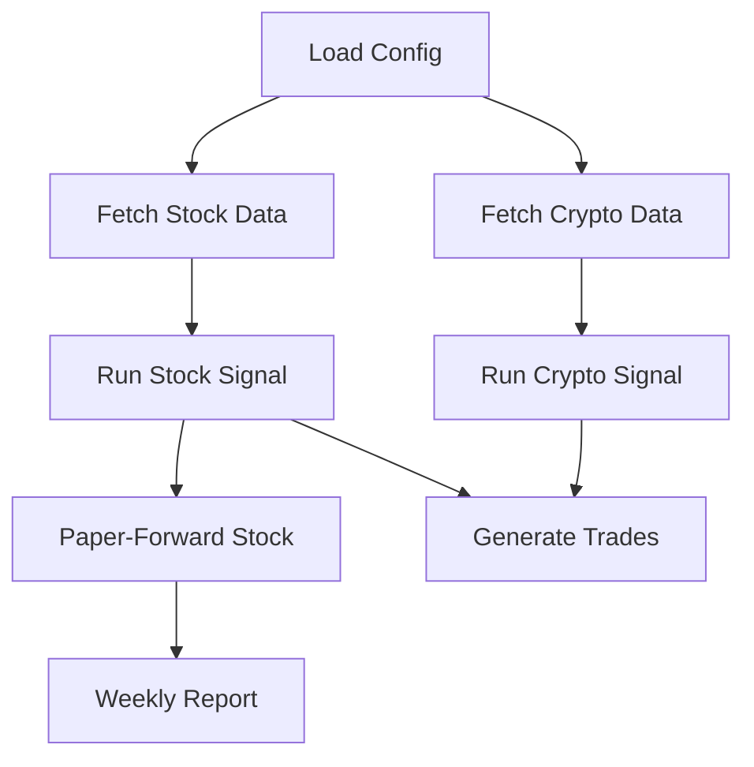
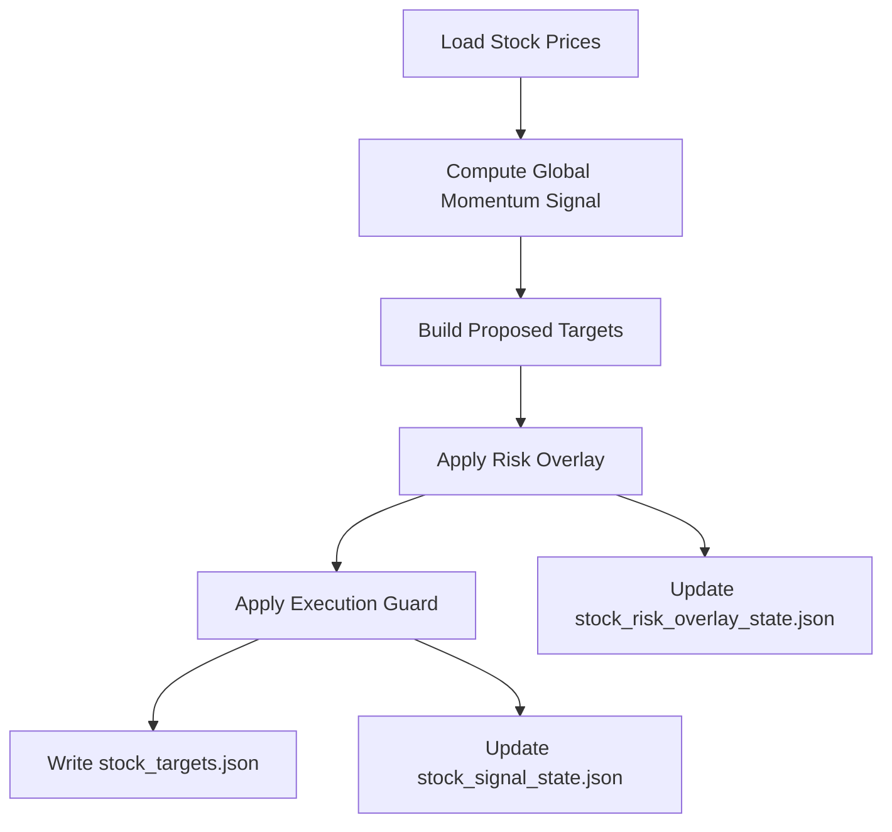
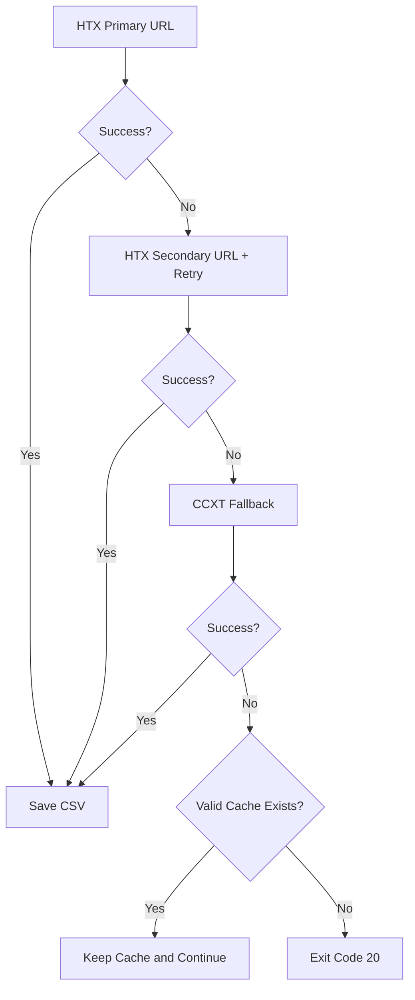

# 量化交易系统 软件需求（生产版）

## 1. 文档目的
本文档定义 `quant-system` 的当前生产候选能力、接口协议、错误码、流程与验收标准。  
文档基于 2026-02-18 最新代码与回测/仿真结果整理。

## 2. 系统范围与目标
### 2.1 范围
- 市场：A 股 ETF（股票子系统）+ 加密货币现货（币圈子系统）。
- 运行模式：默认 `paper`（输出目标仓位与拟交易指令，不直接下单）。
- 能力：拉取数据、计算信号、执行门控、风控覆盖、回测、paper-forward 监控、周报输出。

### 2.2 目标
- 提供可重复运行的自动化策略流水线。
- 信号与输出具备可追踪状态（state + report）。
- 核心脚本在失败时返回标准化退出码，便于调度系统识别。

## 3. 总体架构
### 3.1 模块
- `scripts/fetch_stock_data.py`：拉取/更新 A 股 ETF 数据（含缓存降级）。
- `scripts/fetch_crypto_data.py`：拉取/更新加密数据（HTX 直连 + 多域名重试 + CCXT 兜底 + 缓存降级）。
- `scripts/run_stock.py`：股票信号引擎（`global_momentum` 主模型 + 执行门控 + 风控覆盖）。
- `scripts/run_crypto.py`：币圈信号引擎（多因子 + risk-off）。
- `scripts/generate_trades.py`：目标仓位与当前仓位差分，输出拟交易指令。
- `scripts/backtest_stock_global_model.py`：股票主模型基线回测。
- `scripts/backtest_stock_model_lab.py`：模型对比、参数扰动、walk-forward。
- `scripts/backtest_stock_production_search.py`：生产口径参数搜索（paper-forward 引擎 + 稳定性门控）。
- `scripts/backtest_v3.py`：股票/币圈轻量双市场回测。
- `scripts/paper_forward_stock.py`：股票逐日 paper-forward 监控。
- `scripts/report_stock_weekly.py`：周度聚合报告。
- `scripts/run_all.py`：全流程编排（支持跳过拉取与跳过报告）。

### 3.2 目录
- 输入：`data/stock/*.csv`、`data/crypto/*.csv`
- 输出：`outputs/orders/*`、`outputs/reports/*`、`outputs/state/*`
- 配置：`config/*.yaml`
- 核心函数：`core/signal.py`、`core/exit_codes.py`

## 4. 功能需求
### 4.1 行情拉取
#### 股票
- 使用 AkShare 拉取 ETF 日线。
- 单标失败时若本地缓存文件有效（默认 `>=200` 行且含 `close`）则降级使用缓存。
- 缓存需满足新鲜度（默认 `<=15` 天），超过阈值视为不可用。
- 最终若所有标的均有可用数据（新拉取或缓存）即成功。

#### 币圈
- 首选 HTX REST（`api.huobi.pro` / `api-aws.huobi.pro`），按超时组合重试。
- HTX 失败后尝试 CCXT 兜底（优先 `okx`、`bybit`）。
- 单标失败时若缓存有效则降级使用缓存。
- 缓存需满足新鲜度（默认 `<=5` 天），超过阈值视为不可用。

### 4.2 股票信号模型
#### 生产主模型 `global_momentum`
- 核心逻辑：趋势过滤（基准 `MA`）+ 横截面动量 + 逆波动权重 + 防守资产补位。
- 当前生产参数（2026-02-18）：
  - `momentum_lb=252`
  - `ma_window=180`
  - `vol_window=50`
  - `top_n=4`
  - `fee=0.0008`（回测/仿真使用）
- 当前执行门控参数：
  - `min_rebalance_days=30`
  - `min_turnover=0.03`
  - `force_rebalance_on_regime_change=false`
- 防守资产：`defensive_symbol=511010`
- 基准：`benchmark_symbol=510300`

#### 兼容模型 `legacy_multifactor`
- 保留旧版多因子（动量/波动/回撤/流动性）周频逻辑。

### 4.3 币圈信号模型
- 多因子评分：`momentum + low_vol + drawdown`。
- `top_n` 选标后按仓位上限分配。
- 若全部标的短期收益低于阈值（`risk_off_threshold_pct`），触发 `USDT` 防守目标。

### 4.4 执行门控（股票）
- 状态文件：`outputs/state/stock_signal_state.json`
- 规则：
  - 最小调仓间隔：`min_rebalance_days`（自然日语义，生产与 paper-forward 已统一）
  - 最小换手：`min_turnover`
  - Regime 切换强制调仓：`force_rebalance_on_regime_change`
- 输出字段：`execution_guard`、`proposed_targets`

### 4.5 风控覆盖（股票）
- 状态文件：`outputs/state/stock_risk_overlay_state.json`
- 监控输入：`outputs/reports/stock_paper_forward_latest.json`
- 触发条件（任一满足）：
  - `excess_return_20d_vs_alloc <= trigger_excess_20d_vs_alloc`
  - `strategy_dd <= trigger_strategy_drawdown`
- 触发后：目标仓位强制切防守仓 + `force_rebalance=true`
- 解除（sticky 模式）：
  - 满足 release 阈值
  - 且达到 `min_defense_days`
- 非 sticky 模式：触发条件消失即退出防守（已实现）。

### 4.6 回测与研究
- `stock_global_model_report.json`：主模型全样本/OOS 对比。
- `stock_model_lab_report.json`：模型比较、费率敏感性、参数扰动、walk-forward、推荐结论。
- `stock_production_model_search.json`：生产口径参数搜索报告（分阶段网格 + 稳定性门控）。
- `stock_param_upgrade_report.json`：参数升级前后对比（baseline vs selected）。
- `backtest_report.json`：股票/币圈轻量回测摘要（`global_momentum` 下支持 `backtest_mode=production|research`）。
- `backtest_mode=production`：股票部分使用 production-aligned paper-forward 逻辑（含执行门控）。
- `backtest_mode=research`：股票部分使用研究口径回测（不含执行门控/风控覆盖，仍按 alloc 口径评估）。
- `--stock-mode both`：在 `backtest_v3.py` 中同时输出 production 与 research 两套结果。
- 说明：`stock_global_model_report.json` 与 `stock_model_lab_report.json` 当前仍为研究口径（raw 基准、全仓 sleeve、不含 execution_guard/risk_overlay），报告内含 `assumptions` 字段明确标注。

### 4.7 Paper-Forward 与周报
- `stock_paper_forward_history.csv`：逐日动作、收益、换手、净值、回撤、权重快照。
- `stock_paper_forward_latest.json`：latest + aggregate + rolling 指标。
- `stock_weekly_report.json/.md`：周度、近 4/8 周聚合。
- 周报超额收益口径：`excess = strategy_return - benchmark_alloc_return`（已修正）。

### 4.8 一键编排
- `scripts/run_all.py` 默认顺序：
  1) 拉股票  
  2) 拉币圈  
  3) 股票信号  
  4) 币圈信号  
  5) 股票 paper-forward  
  6) 股票周报
- 环境变量：
  - `QS_SKIP_FETCH=1`：跳过数据拉取
  - `QS_SKIP_REPORTS=1`：跳过报表生成

## 5. 接口协议
### 5.1 输入 CSV
#### 股票 `data/stock/{symbol}.csv`
- 必需列：`date`, `close`
- 推荐列：`open`, `high`, `low`, `volume`, `amount`
- 时间升序

#### 币圈 `data/crypto/{symbol}.csv`
- 必需列：`date`, `close`
- 推荐列：`open`, `high`, `low`, `volume`
- 时间升序

### 5.2 目标仓位输出
#### 股票 `outputs/orders/stock_targets.json`
- 核心字段：
  - `ts`, `market`, `market_date`, `env`, `mode`, `capital`
  - `benchmark_symbol`, `defensive_symbol`, `regime_on`, `signal_reason`
  - `params`, `scores`, `targets`
  - `risk_overlay`, `execution_guard`, `proposed_targets`

#### 币圈 `outputs/orders/crypto_targets.json`
- 核心字段：
  - `ts`, `market`, `env`, `capital`, `risk_off`
  - `factor_weights`, `scores`, `targets`

### 5.3 拟交易指令输出
#### 股票 `outputs/orders/stock_trades.json`
#### 币圈 `outputs/orders/crypto_trades.json`
- 核心字段：
  - `ts`, `market`, `capital_total`, `capital_market`
  - `target_file`, `position_file`
  - `orders[]: {symbol, action, delta_weight, amount_quote}`

### 5.4 状态文件
- `outputs/state/stock_signal_state.json`
- `outputs/state/stock_risk_overlay_state.json`
- `outputs/state/stock_positions.json`
- `outputs/state/crypto_positions.json`

### 5.5 报告文件
- `outputs/reports/stock_global_model_report.json`
- `outputs/reports/stock_model_lab_report.json`
- `outputs/reports/stock_production_model_search.json`
- `outputs/reports/stock_param_upgrade_report.json`
- `outputs/reports/backtest_report.json`
- `outputs/reports/stock_paper_forward_history.csv`
- `outputs/reports/stock_paper_forward_latest.json`
- `outputs/reports/stock_weekly_report.json`
- `outputs/reports/stock_weekly_report.md`

## 6. 错误码与退出约定
统一定义在 `core/exit_codes.py`。

- `0`：成功
- `10`：配置读取/解析失败
- `11`：运行开关关闭或模块关闭
- `20`：数据拉取失败（且无可用缓存）
- `21`：数据格式异常或无可用样本
- `30`：信号/回测计算异常
- `40`：输出写入失败
- `50`：未知运行时错误（预留）

适用脚本：`fetch_*`, `run_*`, `backtest_*`, `paper_forward_stock.py`, `report_stock_weekly.py`。

## 7. 配置需求
### 7.1 `config/runtime.yaml`
- `enabled`, `env`, `timezone`, `base_currency`, `total_capital`
- `paths.data_dir`, `paths.output_dir`, `paths.log_dir`

### 7.2 `config/stock.yaml`（重点）
- `mode: global_momentum`
- `backtest_mode: production | research`
- `global_model`：
  - `rebalance_days`, `momentum_lb`, `ma_window`, `vol_window`, `top_n`, `fee`, `min_score`
  - `execution_guard.*`
  - `risk_overlay.*`
- `benchmark_symbol`, `defensive_symbol`, `capital_alloc_pct`, `universe`

### 7.3 `config/crypto.yaml`
- `exchange`, `symbols`, `capital_alloc_pct`
- `signal.*`
- `defense.*`

### 7.4 `config/risk.yaml`
- `position_limits.stock_single_max_pct`
- `position_limits.crypto_single_max_pct`
- 其他风控阈值

## 8. 流程图
### 8.1 全流程

### 8.2 股票信号与风控流程

### 8.3 币圈拉取降级流程

## 9. 测试与验收
### 9.1 自动化测试
- 命令：`PYTHONPYCACHEPREFIX=/tmp/pycache python3 -m unittest discover -s tests -v`
- 当前：`25` 项测试通过。
- 覆盖点：
  - 核心因子函数
  - 股票执行门控与风控覆盖（含非 sticky 释放）
  - 币圈拉取解析与目标仓位生成
  - paper-forward 与周报口径
  - 回测报告生成
  - 生产参数搜索评分与稳定性门控
  - 交易指令生成
  - `run_all` 冒烟（跳过拉取模式）

### 9.2 运行验收命令
- `python3 scripts/fetch_stock_data.py`
- `python3 scripts/fetch_crypto_data.py`
- `python3 scripts/run_stock.py`
- `python3 scripts/run_crypto.py`
- `python3 scripts/paper_forward_stock.py`
- `python3 scripts/report_stock_weekly.py`
- `python3 scripts/backtest_stock_global_model.py`
- `python3 scripts/backtest_stock_model_lab.py`
- `python3 scripts/backtest_v3.py`
  - `python3 scripts/backtest_v3.py --stock-mode both`
- `python3 scripts/run_all.py`

要求：全部退出码为 `0`；关键输出文件生成且结构正确。

## 10. 当前已知限制与运维说明
- 在受限网络/代理不可达场景，拉取脚本会降级使用本地缓存并提示告警信息。
- macOS `LibreSSL` 环境可能出现 `urllib3` 警告（非阻断）；建议长期迁移到 OpenSSL 1.1.1+ Python 运行时。
- 若缓存数据长期不更新，会导致策略信号陈旧；需在调度层增加“数据新鲜度”巡检。

## 11. 生产就绪判定标准
满足以下条件可进入生产候选状态：
- 自动化测试全通过。
- 回测与 paper-forward 报告可稳定生成。
- 全流程脚本（`run_all.py`）可重复运行且退出码稳定。
- 关键状态文件与报告文件持续更新。
- 调度系统可识别标准错误码并进行告警。

## 12. 当前参数效果快照（2026-02-18）
- 来源文件：`outputs/reports/stock_paper_forward_latest.json`
  - 策略年化：`9.0626%`
  - 基准年化（alloc）：`4.8379%`
  - 年化超额（vs alloc）：`+4.2247%`
  - 年化超额（vs raw）：`+2.7766%`
  - 策略最大回撤：`-11.6951%`
  - 策略 Sharpe：`0.8093`
- 升级对比：`outputs/reports/stock_param_upgrade_report.json`
  - full 年化超额（vs alloc）：`-1.1053% -> +4.2247%`
  - oos_2024 年化超额（vs alloc）：`-3.9842% -> +16.1318%`
  - oos_2025 年化超额（vs alloc）：`-8.5093% -> +37.1255%`
